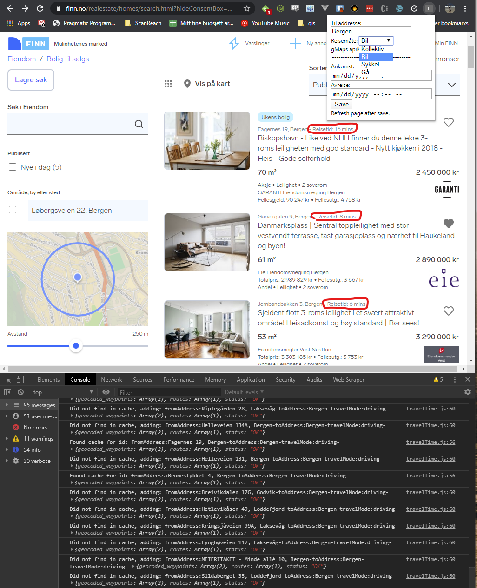

# Finn-no-Reisetid-Chrome-Extension
Finn.no reisetid fra annonse til addresse med bil, kollektiv, sykkel eller gå som en chrome extension.
Kommer nok snart i en chrome extension butikk nær deg (Den blir sikkert aldri publisert). 

Skikkelig hacky kode skrevet av meg, men det funker.

Av funksjoner som er verdt å nevne:
- Knyttet til Google Maps Directions API
- Cache av reisetider i local chrome extension storage

Hvordan ta koden i bruk:
1. Last ned koden
2. Gå til: chrome://extensions
3. Aktiver developer
4. Klikk "load unpacked" og finn fram manifest.json filen du lastet ned i step 1
5. Klikk på "F" ikonet i "chrome-baren"
6. Fyll inn ønsket destinasjon
7. Fyll inn apiKey
8. Save
9. Besøk finn og se magien skje

Hvordan hente Google Maps Directions API key:
https://developers.google.com/maps/documentation/directions/get-api-key?hl=nb

Tar gjerne imot innspill og tips!
